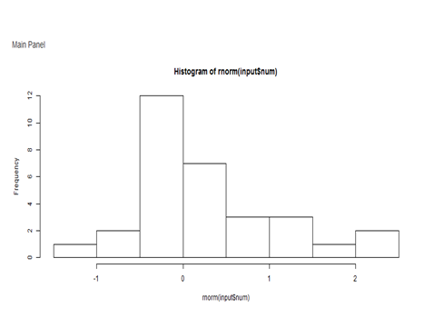

Create A Histogran With Random Number
========================================================
Prepared by : Azlena Haron 
31 Jan 2016

CONTENT
========================================================

- Introduction
- Why R
- Random Number
- Histrogram
- Conclusion

INTRODUCTION
========================================================
This assignment is a mini project to measure my level knowledge in Data Analytic.This subject was very challenges but interesting and need for our agency.

The purposed of this project is to produce interactive apps.To come out with apps, I have to know related packages and library. I just try the very simple apps name as Created Histrogram Using Random Number 

The apps should consist of two apps; server.R and ui.R.  The application shared on github.

WHY R?
========================================================
R is a programming language and software environment for statistical computing and graphics supported by the R Foundation for Statistical Computing. The R language is widely used among statisticians and data miners for developing statistical software and data analysis.

The R programming language is an important tool for development in the numeric analysis and machine learning spaces. With machines becoming more important as data generators, the popularity of the language can only be expected to grow.

RANDOM NUMBER
========================================================
To a very high degree computers are deterministic and therefore are not a reliable source of significant amounts of random values. In general pseudo random number generators are used. The default algorithm in R is Mersenne-Twister but a long list of methods is available. See the help of RNGkind() to learn about random number generators.

 

Slide With Histogram
========================================================
The bar plot is an estimate of the probability distribution
P(V=v). Itis more appropriate than a histogram, because the data are discrete, not
continuous. We also can calculate the mean, standard deviation and variance of the sample using Random Number.

 

CONCLUSION
========================================================

As conclusion, I have real experience ond Data Analytic through Data Science Program